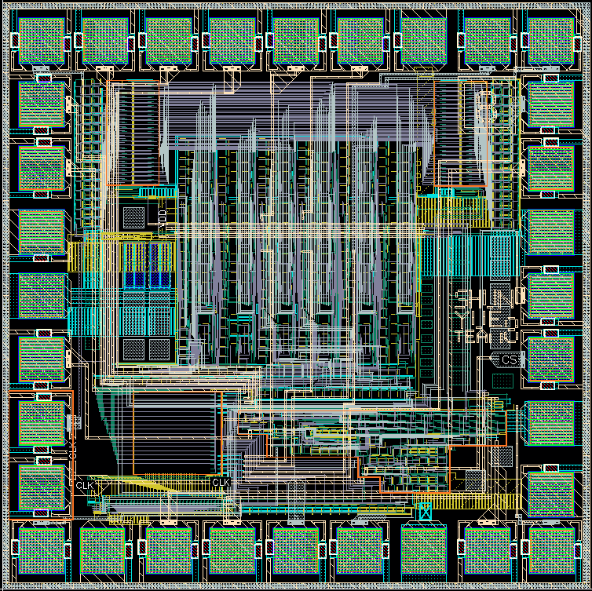
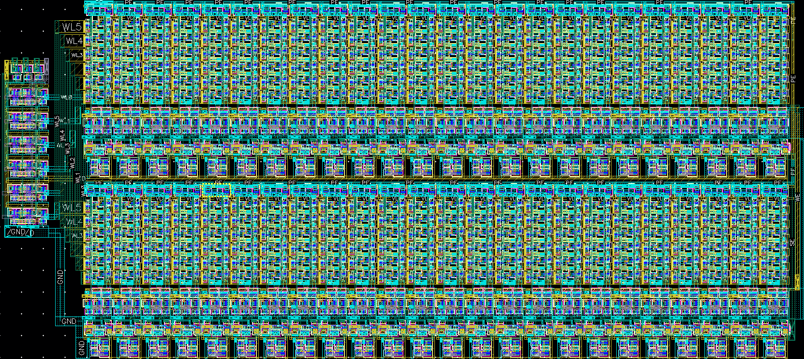
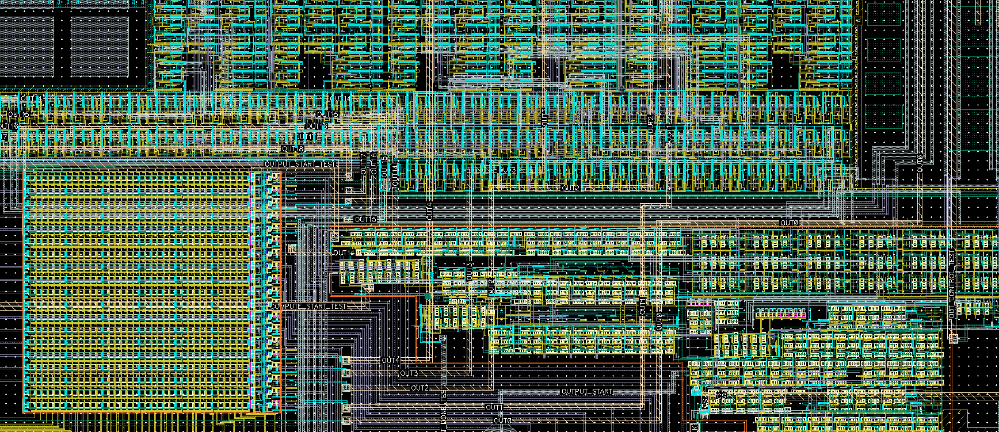
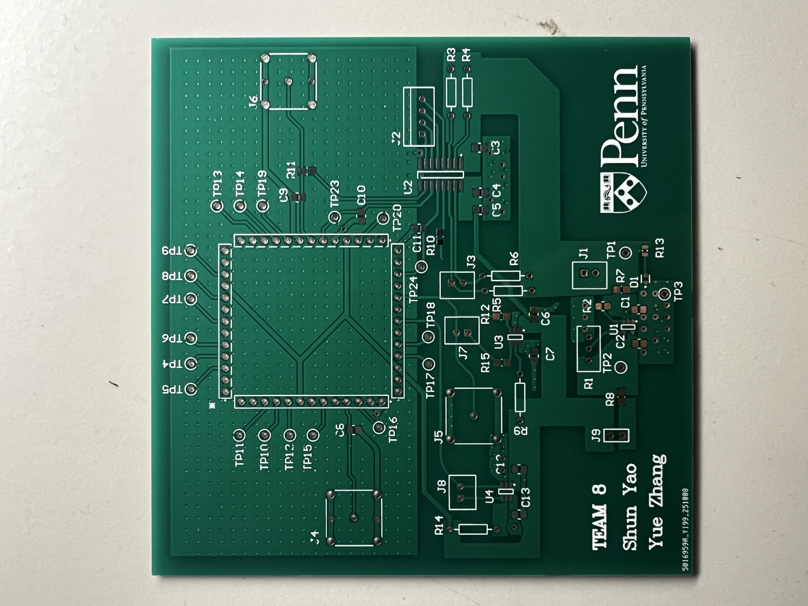
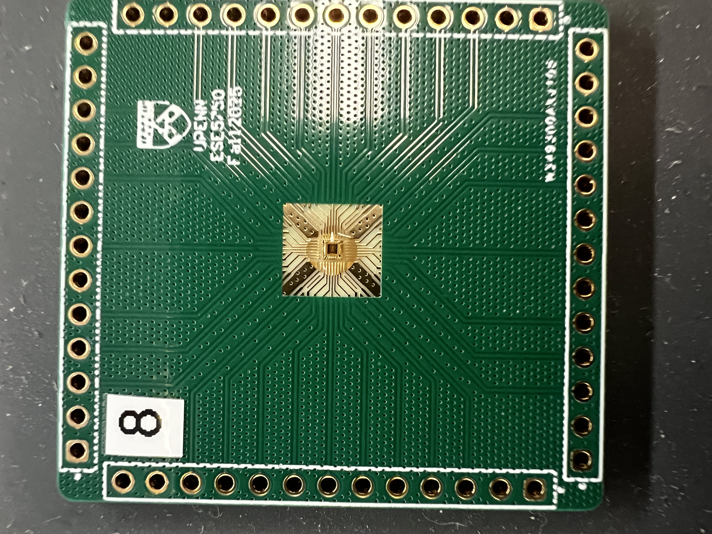

# Tape-out-8-bit-6x6-Matrix-Multiplier-Engine-in-TSMC-180nm-Proces
Developed an 8-bit 6×6 matrix multiplier engine with a custom memory control system and a cross-product computation unit. Integrated SRAM array, SIPO shift registers, and a State Machine for efficient data handling. 

